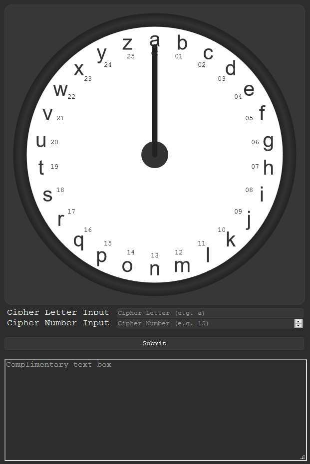

# Cipher
A proof-of-concept idea of how a cipher could be used with letters and numbers.

## Use
> "A message for this cipher to decode looks like this: '__t14r13i03j02a14__'. To decode messages, simply break the string down into sections, like '__t14__', '__r13__', '__i03__', '__j02__', '__a14__'. These sections tell you what to enter into the cipher. Separate the letters and numbers, then enter them into the respective inputs. Click Submit, and the short arm wil show you the true letter encoded within the inputs."

## Encoding
Currently, in v0.1.0, encoding must be done manually. Simply pick a random letter, and count the letters between the random letter and the letter you're trying to encode. Put the random letter and number together, and you've successfully encoded a letter. For example, `x` can be encoded as `u03`, `j14`, `g17`, and many more. Just repeat the process for all the letters in your message and concatenate the remaining letter-number pair, like so: `t14r13i03j02a14 f17a14q01v16a03`. (Note: that message has 10^26^26 combinations, or 1e+676!)

